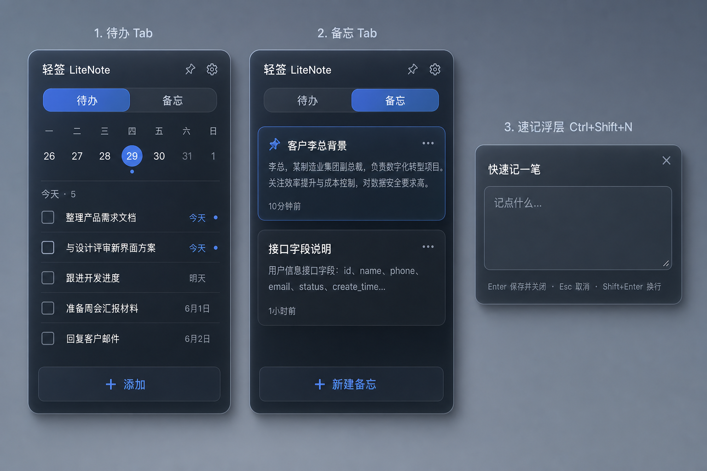

# 备忘 / 速记功能方案

> 版本：v0.1（设计稿）  
> 状态：待实现  
> 示意图：项目根目录 [`litenote-memo-design-mockup.png`](../litenote-memo-design-mockup.png)

---

## 1. 背景与目标

LiteNote 当前是**任务清单**桌面小部件：勾选、截止日、循环、周日历筛选。办公场景中还有大量**「先记下、不急着做完」**的信息（客户背景、接口说明、临时想法），不适合塞进待办列表。

本方案在**不改动小窗定位**的前提下，增加：

1. **备忘 Tab** — 同面板内浏览、编辑、管理多行备忘  
2. **全局速记** — `Ctrl+Shift+N` 独立浮层，Enter 保存并关闭  

与待办形成互补：**待办 = 要做的事；备忘 = 要记住的事**。

### 1.1 非目标（MVP 不做）

- Markdown 渲染、图片附件、文件夹分类  
- 全文搜索（可二期）  
- 与邮件 / 日历 / 云文档联动  
- Agent 自动摘要（预留接口，本期不实现）

---

## 2. 产品示意



左：待办 Tab（现有能力）  
中：备忘 Tab（卡片列表）  
右：`Ctrl+Shift+N` 独立速记浮层  

---

## 3. 心智模型对比

| 维度 | 待办（Todo） | 备忘（Memo） |
|------|-------------|-------------|
| 核心问题 | 要不要做？做完了吗？ | 怕忘 / 先搁这 / 以后查 |
| 典型内容 | 单行动作项 | 多行段落、摘录 |
| 勾选完成 | ✅ | ❌ |
| 截止日 / 提醒 / 循环 | ✅ | ❌ |
| 周日历筛选 | ✅ | ❌ |
| 排序 | 置顶 + 拖拽 `sort_order` | 置顶优先，其余按 `update_time` 倒序 |
| 列表形态 | `TodoRow` 单行 | 卡片（标题 + 预览 + 时间） |

---

## 4. 界面设计

### 4.1 外壳不变，中间内容区按 Tab 切换

Header、玻璃面板、Footer 风格与现有一致。`HeaderBar` 标题右侧增加分段控件：

```
[ 待办 | 备忘 ]
```

- 选中态与现有主题 accent 一致  
- 切换 Tab 时记住上次选择（`settings` 表持久化 `activePanel: 'todo' | 'memo'`）  
- 专注模式（`focusMode`）下：**仅显示待办 Tab**，隐藏分段控件或锁定在待办  

### 4.2 待办 Tab

与当前 `WidgetShell` 行为一致，不赘述：

- `ClockSection`（可折叠）  
- `WeekCalendar`  
- `TodoList` + `FooterBar`（＋添加 / 导出 / 清除完成）

### 4.3 备忘 Tab

```
┌──────────────────────────────┐
│ 轻签 LiteNote    [待办│备忘]   │
├──────────────────────────────┤
│ 🔍 搜索备忘…                  │  ← 二期，MVP 可省略
├──────────────────────────────┤
│ 📌 客户李总背景               │
│    喜欢线下见面，对交付周期…   │  ← 正文预览最多 2 行，超出省略
│    10 分钟前                   │
├──────────────────────────────┤
│ 接口返回字段说明               │
│    status=1 成功…              │
│    昨天                        │
├──────────────────────────────┤
│ ＋ 新建备忘                    │
└──────────────────────────────┘
```

**刻意去掉的元素：** 周日历、勾选框、截止日、循环、拖拽排序、拖入日历。

**卡片字段展示：**

- 置顶：📌 图标或左侧色条  
- 标题：有 `title` 用 `title`，否则取正文首行（超 30 字截断 + `…`）  
- 预览：正文去掉首行后或全文，最多 2 行  
- 时间：相对时间（刚刚 / N 分钟前 / 昨天 / 日期）

**Footer：** 仅保留「＋ 新建备忘」；导出 / 清除完成隐藏（或导出合并到设置，二期）。

### 4.4 备忘编辑层

点击卡片进入编辑（推荐 **同面板内全屏替换列表**，与 `SettingsModal` 层级类似，但非 Portal 弹窗亦可）：

```
┌──────────────────────────────┐
│ ← 返回                  📌 🗑  │
├──────────────────────────────┤
│ （可选）标题输入，单行          │
├──────────────────────────────┤
│                              │
│  多行 textarea，自动增高       │
│                              │
├──────────────────────────────┤
│ 转为待办 · 复制               │
└──────────────────────────────┘
```

| 操作 | 行为 |
|------|------|
| ← 返回 | 保存当前编辑，回到列表 |
| 📌 | 切换置顶 |
| 🗑 | 确认后删除 |
| 转为待办 | 见 §6.3 |
| 复制 | 复制全文到系统剪贴板 |

编辑时 `update_time` 在 blur 或返回时更新。

### 4.5 全局速记浮层（`Ctrl+Shift+N`）

**独立 Tauri 小窗口**（参考现有 `?window=reminder` 模式），非主窗 overlay。

```
        ┌─────────────────────────┐
        │ 快速记一笔          ×   │
        ├─────────────────────────┤
        │                         │
        │  记点什么…               │  autofocus textarea
        │                         │
        ├─────────────────────────┤
        │ Enter 保存 · Esc 取消    │
        │ Shift+Enter 换行         │
        └─────────────────────────┘
```

| 按键 | 行为 |
|------|------|
| **Enter** | 正文非空 → 写入 `memos` → **关闭窗口** |
| **Enter**（空内容） | 不写入，直接关闭 |
| **Shift+Enter** | 换行 |
| **Esc** | 不保存，关闭 |
| **×** | 同 Esc |

**保存规则：**

- `title`：正文第一行，超 30 字截断；若仅一行则 `title` 与 `body` 相同  
- `body`：完整输入（保留换行）  
- `pinned`：`false`  
- `create_time` / `update_time`：当前毫秒时间戳  

**窗口特性：**

- 尺寸约 **320 × 140**（可随内容微扩，上限约 200px 高）  
- 无边框、透明背景，与主窗主题一致（读取 `settings.theme`）  
- 屏幕居中，或记住上次位置（二期）  
- 主窗隐藏到托盘时仍可唤起  
- 保存后 `emit('litenote-memos-updated')`，主窗备忘 Tab 自动刷新  

**与现有快捷键关系：**

| 快捷键 | 现有功能 |
|--------|----------|
| `Ctrl+Shift+L` | 显示/隐藏主窗 |
| `Ctrl+Shift+F` | 专注/完整模式 |
| `Ctrl+Shift+P` | 置顶切换 |
| **`Ctrl+Shift+N`** | **新增：打开速记浮层** |

> `N` = Note。若与系统冲突，设置中可配置（二期）。

---

## 5. 数据模型

### 5.1 新表 `memos`（独立于 `todos`）

不采用 `todos.kind` 混用，避免 store / UI 分支膨胀。

```sql
CREATE TABLE IF NOT EXISTS memos (
  id           TEXT PRIMARY KEY,
  title        TEXT NOT NULL DEFAULT '',
  body         TEXT NOT NULL DEFAULT '',
  pinned       INTEGER NOT NULL DEFAULT 0,
  archived     INTEGER NOT NULL DEFAULT 0,
  create_time  INTEGER NOT NULL DEFAULT 0,
  update_time  INTEGER NOT NULL DEFAULT 0
);
```

### 5.2 TypeScript 类型

新建 `src/types/memo.ts`：

```ts
export interface MemoItem {
  id: string;
  title: string;
  body: string;
  pinned: boolean;
  archived: boolean;
  createTime: number;
  updateTime: number;
}
```

### 5.3 设置项扩展

`DEFAULT_SETTINGS` 增加：

```ts
activePanel: "todo" as "todo" | "memo",
```

### 5.4 迁移策略

在 `src/lib/db.ts` 的 `initTables` 中：

- `CREATE TABLE IF NOT EXISTS memos (...)`  
- 沿用项目现有 `EXPECTED_*_COLUMNS` 模式，便于后续加列  

---

## 6. 核心业务规则

### 6.1 列表排序

1. `pinned = true` 在前  
2. 同组内按 `update_time` 降序  

MVP 不做拖拽排序。

### 6.2 标题生成

```ts
function deriveTitle(body: string, maxLen = 30): string {
  const firstLine = body.split(/\r?\n/)[0]?.trim() ?? "";
  if (firstLine.length <= maxLen) return firstLine;
  return firstLine.slice(0, maxLen) + "…";
}
```

速记浮层保存时：若用户未单独填标题，用 `deriveTitle(body)`。

### 6.3 转为待办

从备忘编辑页触发：

1. 取 `title` 非空 ? `title` : `deriveTitle(body)` 作为待办 `text`（单行，截断至待办合理长度，如 200 字）  
2. 若 `body` 比标题更长，可选：  
   - **MVP**：仅创建待办，备忘保留不删  
   - **增强**：待办支持 `note` 字段时，余下正文写入备注（见 §9 扩展）  
3. `addTodo` 后 toast「已转为待办」  
4. 不自动删除原备忘（用户手动删）

### 6.4 归档（二期预留）

`archived = 1` 的备忘默认列表不展示；MVP 可只做硬删除。

---

## 7. 架构与模块划分

### 7.1 目标目录结构

```
src/
├── types/
│   └── memo.ts                    # MemoItem
├── lib/
│   └── db.ts                      # + memos CRUD
├── stores/
│   └── memoStore.ts               # 对标 todoStore
├── hooks/
│   └── useMemoActions.ts          # 对标 useWidgetActions
├── components/
│   ├── widget/
│   │   ├── PanelSwitcher.tsx      # [待办|备忘] 分段控件
│   │   ├── MemoList.tsx
│   │   ├── MemoCard.tsx
│   │   ├── MemoEditor.tsx
│   │   └── WidgetShell.tsx        # 按 activePanel 分支渲染
│   └── window/
│       └── QuickCaptureWindow.tsx # ?window=capture
└── App.tsx                        # + capture 分支

src-tauri/
├── src/lib.rs                     # + 全局快捷键 Ctrl+Shift+N、show_capture_window
├── tauri.conf.json                # + capture 窗口 preset（可选）
└── capabilities/default.json      # capture 窗口权限
```

### 7.2 数据流

```
QuickCaptureWindow ──insert──► db.ts (memos)
                                    │
memoStore ◄──load/update────────────┘
    │
    ▼
MemoList / MemoEditor

跨窗口：emit('litenote-memos-updated') → memoStore.reloadFromDb()
```

与待办同步模式一致（参考 `litenote-todos-updated`）。

### 7.3 `memoStore` 接口草案

```ts
interface MemoStore {
  memos: MemoItem[];
  lastError: string | null;
  editingId: string | null;

  init: () => Promise<void>;
  reloadFromDb: () => Promise<void>;
  createMemo: (body: string, title?: string) => string;
  updateMemo: (id: string, patch: Partial<Pick<MemoItem, "title" | "body" | "pinned">>) => void;
  deleteMemo: (id: string) => void;
  togglePinned: (id: string) => void;
  setEditingId: (id: string | null) => void;
}
```

乐观更新 + `dbWrite` 错误反馈，复用 `todoStore` 模式。

### 7.4 `db.ts` 新增函数

```ts
loadMemos(): Promise<MemoItem[]>
insertMemo(item: MemoItem): Promise<void>
updateMemo(item: MemoItem): Promise<void>
removeMemo(id: string): Promise<void>
```

---

## 8. Tauri / 路由实现要点

### 8.1 前端路由（`App.tsx`）

```tsx
const params = new URLSearchParams(window.location.search);
const windowKind = params.get("window");

if (windowKind === "reminder") return <ReminderWindow />;
if (windowKind === "capture") return <QuickCaptureWindow />;
return <MainApp />;
```

### 8.2 Rust：打开速记窗

参考 `show_reminder_window`：

- `label`: `"capture"`（单例，已存在则 `set_focus`）  
- `url`: `index.html?window=capture`  
- 尺寸 320×140，无边框，透明  
- 注册 `CmdOrCtrl+Shift+N` 在 `lib.rs` 现有快捷键块之后  

### 8.3 关闭速记窗

前端保存成功后：

```ts
await getCurrentWindow().close();
```

无需新增 Tauri command（与提醒窗不同，不改 DB 以外的 Rust 状态）。

### 8.4 Capabilities

为 `capture` 窗口 label 增加与 `main` 相同的 SQL 权限；无需 notification。

---

## 9. 国际化

在 `src/i18n/messages.ts` 增加键（示例）：

| Key | zh-CN | en |
|-----|-------|-----|
| `panelTodo` | 待办 | Tasks |
| `panelMemo` | 备忘 | Notes |
| `memoNew` | 新建备忘 | New note |
| `memoEmpty` | 还没有备忘 | No notes yet |
| `captureTitle` | 快速记一笔 | Quick note |
| `capturePlaceholder` | 记点什么… | Jot something down… |
| `captureHint` | Enter 保存 · Esc 取消 · Shift+Enter 换行 | Enter save · Esc cancel · Shift+Enter newline |
| `memoConvertTodo` | 转为待办 | Convert to task |
| `memoConverted` | 已转为待办 | Converted to task |
| `memoDeleteConfirm` | 删除这条备忘？ | Delete this note? |

---

## 10. 实现分期

### Phase 1 — 数据层 + Store（约 1–2 天）

- [ ] `memos` 表与 `MemoItem` 类型  
- [ ] `db.ts` CRUD  
- [ ] `memoStore.ts` + `initMemosSync`（listen `litenote-memos-updated`）  
- [ ] `useAppInit` 中初始化 memoStore  

### Phase 2 — 备忘 Tab UI（约 2–3 天）

- [ ] `PanelSwitcher` + `settings.activePanel`  
- [ ] `MemoList` / `MemoCard` / `MemoEditor`  
- [ ] `WidgetShell` Tab 分支  
- [ ] Footer 文案随 Tab 切换  
- [ ] 转为待办、复制、删除  

### Phase 3 — 全局速记（约 1–2 天）

- [ ] `QuickCaptureWindow.tsx`  
- [ ] `App.tsx` capture 分支  
- [ ] Rust：`show_capture_window` + `Ctrl+Shift+N`  
- [ ] `tauri.conf.json` / capabilities  
- [ ] 保存后 emit 同步  

### Phase 4 — 打磨（约 1 天）

- [ ] 相对时间文案  
- [ ] 空状态、错误 toast  
- [ ] 专注模式隐藏备忘 Tab  
- [ ] `docs/CHANGELOG.md` 条目  
- [ ] 设置页补充快捷键说明（可选）

---

## 11. 测试要点

| 场景 | 预期 |
|------|------|
| 速记 Enter 保存 | `memos` 新增一条，浮层关闭 |
| 速记 Esc | 无新记录，浮层关闭 |
| 速记空 Enter | 无新记录，浮层关闭 |
| 主窗备忘 Tab | 看到刚保存的卡片 |
| 主窗隐藏时速记 | 仍可打开并保存 |
| 编辑返回 | `update_time` 更新，排序可能变化 |
| 转为待办 | 待办列表新增一条，备忘仍在 |
| 跨窗同步 | 速记保存后主窗列表自动刷新 |
| 专注模式 | 不显示备忘 Tab |

---

## 12. 后续扩展（不在 MVP）

| 能力 | 说明 |
|------|------|
| 待办 `note` 字段 | 转待办时正文挂备注 |
| 备忘全文搜索 | 列表顶部的 🔍 |
| 备忘导出 | 并入 `exportTodos` 或独立 `.txt` |
| 剪贴板 → 备忘 | 读剪贴板一键写入 |
| Agent `create_memo` / `search_memos` | 接智能体 Tool |
| 快捷键可配置 | 设置页自定义 |
| Markdown | `body` 存储不变，展示层渲染 |

---

## 13. 与智能体路线图的关系

本功能完成后，可自然扩展：

- **内置 Tool**：`create_memo`、`list_memos`、`convert_memo_to_todo`  
- **SKILL**：「粘贴会议纪要 → 拆备忘 → 用户确认转待办」  
- **速记 + Agent**：浮层旁「让 AI 整理」按钮（远期）  

备忘与待办分表，Agent schema 清晰，无需从单行 `text` 猜测类型。

---

## 14. 参考实现

| 现有模块 | 备忘可对齐的模式 |
|----------|------------------|
| `ReminderWindow.tsx` | 独立 `?window=` 子窗 |
| `todoStore.ts` | 乐观更新 + `dbWrite` |
| `initTodosSync` | `litenote-memos-updated` 事件 |
| `lib.rs` 快捷键块 | `Ctrl+Shift+N` 注册位置 |
| `SettingsModal` | 编辑层返回交互 |

---

*文档结束。实现时以本文为准；若与代码冲突，以代码为准并回写本文。*
